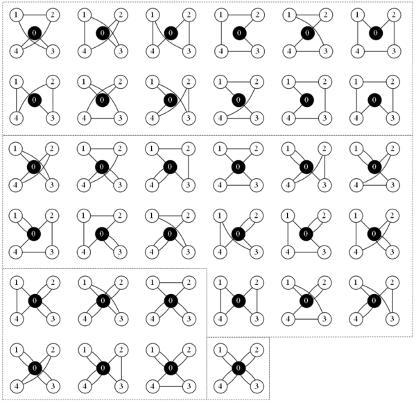

*All possible solutions for a symmetric CVRP N=4*

# CVRP solution generator
The tool comes with three alternative methods to generate (enumerate) all possible solutions of a vehicle routing problem (VRP). This brute-force approach is feasbible when faced with problems less than 11 customers. If one has the CPU time and is not in a hurry, problems with 11, 12, and 13 customers still have sensible enumeration times.

Please note that solving CVRPs through enumeration is not considered to be an efficient (nor recommended) way of solving these problems. This tool was written mainly for visualization of tiny CVRP instances. If one wants to solve these problems, please look into ombinatorial optimization with mixed integer programming (MIP) including techniques such as branch-and-bound and column generation and similar. If one does not actually need gurarantee the finding the very best (optimal) solution, which is the case in most practical applications, please look into VRP construction heuristics, local search heuristics, and metaheuristics. 

## Performance

The tool is written in C++ for extra speed, but I acknowledge that there is surely room to further optimize the procedures. Currently the tool is able to output around 77 000 solutions per wall time second which includes counting of the generated solutions with `wc -l`. This was measured on a Windows 7 PC with MSVC++ 12.0, and a i5 M 460 @ 2.53GHz. If we do not define the `PRINT_SOLUTIONS` preprocessing directive the tool only internally counts the solutions andwe can enumerate over 5M solutions per wall second on this i5 setup. Thus, the generator is already heavily bottlenecked by the input/output. With g++ 5.4.0 (`-O3`), Ubuntu 16.04, and Intel(R) Xeon(R) CPU E5-2673 @ 2.40GHz the tool can enumerate over 14M solutions per second. If one would like to go even faster, it would be trivial make the generators multithreaded. Pull requests implementing this are welcome.

## Results

N | CVRP solution count | verified with `permutations` | verified with `giant_tours` | verified with `matrix`  
--- | --- | --- | --- | --- 
1 | 1                   | X (0.00s)  | X (0.00s) | X (0.00s)
2 | 2                   | X (0.00s)  | X (0.00s) | X (0.00s)
3 | 7                   | X (0.00s)  | X (0.00s) | X (0.00s)
4 | 34                  | X (0.00s)  | X (0.00s) | X (0.00s)
5 | 206                 | X (0.00s)  | X (0.00s) | X (0.00s)
6 | 1486                | X (0.00s)  | X (0.00s) | X (0.04s)
7 | 12412               | X (0.00s)  | X (0.00s) | X (0.47s)
8 | 117692              | X (0.01s)  | X (0.01s) | X (6.45s)
9 | 1248004             | X (0.10s)  | X (0.12s) | X (1m36s)
10 | 14625856           | X (1.07s)  | X (1.40s) | X (25m36s)
11 | 187638716          | X (13.2s)  | X (18.5s) | 
12 | 2614602112         | X (2m59s)  | X (4m20s) | 
13 | 39310384192        | X (44m26s) | X (1h6m) | 
14 | 634148436104       | X (11h59m) | X (18h6m) | 
15 | 10923398137576     | X (8d16h) | X (13d2h) |
16 | 200069534481616*   | * (~160d) |   | 

*) The [1] contains a closed form formula for calculating the number of solutions to a CVRP of any size. There is a Python 2.7 [script](Evaluate%20the%20formula%20for%20the%20number%20of%20possible%20solutions%20to%20a%20capacitated%20vehicle%20routing%20problem_py27.py) included in this repository to evaluate that formula. Also, as one can see, the script contains additional details of the different parts of the closed form.

*The solution counts are validated on a Intel(R) Xeon(R) CPU E5-2673 v3 @ 2.40GHz server*

## Details on the Generator Methods

Of the three the `permutations` based method is the fastest with the `giant_tour` coming as the close second. The `matrix` method is the slowest. A more complete explanation of the methods can be found from the paper Rasku et al. 2013 [1], but the methods are also summarized in the following list. Here, *N* is used to denote the number of customers.
* `permutations` selects all possible (valid) start and end nodes (combinations) for all possible route counts 1..*N*. The remaining points are distributed to the routes in all possible permutations.
* `giant_tours` constructs all hamiltonian cycles and recursively inserts all possible visits to the depot. The visits must fulfill some precendence conditions so that generating the same solution twice is avoided. This is perhaps the cleanest implementation of the three.
* `matrix` uses an alternate encoding of the solutions. A solution is encoded as a binary *N*x*N* matrix where each value decides if a vehicle should travel from the node *i* to node *j*. However, internally the matrix is actually Matt McCutchen's bigint [2] which is usually incremented by one on each step. After each incerement some node connectivity and continuation conditions are checked and some configurations may be skipped to get the first solution that fixes the invalid condition. Each solution candidate that has passed the connectivity conditions is converted to a giant tour encoded solution. However it can be rejected during the conversion if there are subtours (there is a circular route that does not go through the depot). 

## License and disclaimer

This tool is MIT licensed, so use it as you please as long as I get attribution. Also remember that IN NO EVENT SHALL I BE LIABLE TO ANY PARTY FOR DIRECT, INDIRECT, SPECIAL, INCIDENTAL, OR CONSEQUENTIAL DAMAGES, INCLUDING LOST PROFITS, ARISING OUT OF THE USE OF THIS SOFTWARE AND ITS DOCUMENTATION, EVEN IF REGENTS HAS BEEN ADVISED OF THE POSSIBILITY OF SUCH DAMAGE.

## Cloning and compiling instructions

Solution and project files are provided for Visual Studio 2013 and Codelite. Before you try to comile, be sure to clone all externals with the repository using the command: `git clone --recursive git://github.com/foo/bar.git`

You need not to use an IDE. You can also just use make by issuing command `make -f vrp_gen.mk`.

## References

[1] Rasku, J., Kärkkäinen, T., Hotokka, P. (2013) Solution Space Visualization as a Tool for Vehicle Routing Algorithm Development. In M. Collan, J. Hämäläinen and P. Luukka (eds.) Proceedings of FORS40 Workshop. 20.-21.8.2013. Lappeenranta, Finland. p. 9-12

[2] McCutchen, M. C++ Big Integer Library. 2010-04-30 version. Available online: https://mattmccutchen.net/bigint/
